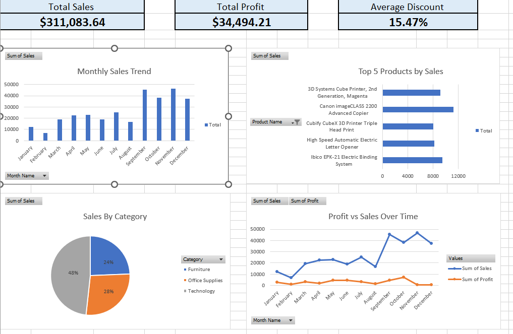

# retail-sales-dashboard
# 🧾 Retail Sales Dashboard (Excel)

## 📖 Overview
An interactive Excel dashboard visualizing retail performance metrics, including sales, profit, and category trends. Designed for easy biweekly data updates.

## 🧰 Tools & Skills
- Excel Tables, PivotTables, Dynamic Charts
- Power Query
- Formulas: XLOOKUP, FILTER, LET
- Dashboard Layout & Visualization

## 📈 Key Features
- Dynamic KPI cards for Sales, Profit, Discount
- Monthly and Regional Sales Trends
- Top Products and Categories Visualization
- Slicers for interactivity

## 📊 Preview

## 💡 Insights
This dashboard allows stakeholders to monitor key business metrics at a glance and identify sales trends across regions and product categories.

